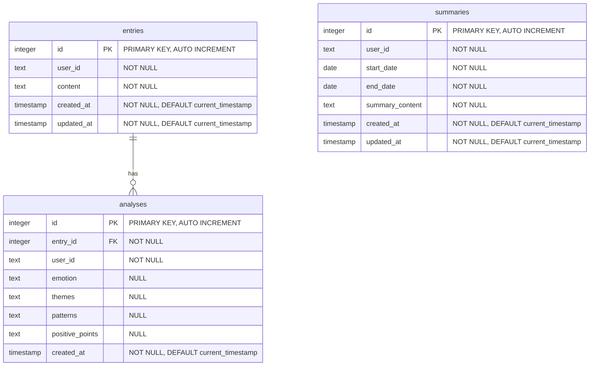

# ER Diagram

## ER図



## ER図の生成方法

このER図は、DBMLスキーマファイル（`schema.dbml`）から手動で作成されています。

### 自動生成スクリプト

`scripts/generate-erd.sh`を実行すると、以下のファイルが生成されます：

```bash
# ER図関連ファイルの生成
pnpm run generate:erd
```

生成されるファイル：
- `_llm-docs/diagrams/schema.sql` - フォーマット済みのSQLスキーマ
- `_llm-docs/diagrams/er-diagram.md` - Mermaid形式のER図（このファイル）

### Mermaidダイアグラムの表示方法

1. **VS Code / Cursor**
   - Markdown Previewを使用（Cmd+Shift+V）
   - Mermaid対応の拡張機能をインストール

2. **GitHub**
   - GitHubは`.md`ファイル内のMermaidコードブロックを自動的にレンダリング

3. **オンラインツール**
   - [Mermaid Live Editor](https://mermaid.live)